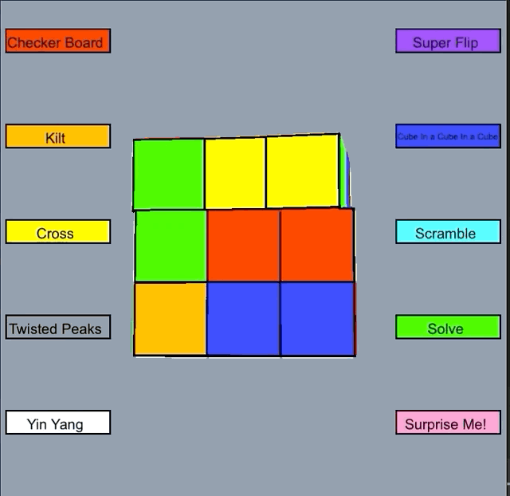

# Interactive Rubik's Cube
 
## Description
This project is an interactive Rubik's Cube! A user can use key presses to rotate it any way they please. There are also built in patterns that can be accessed by 
clicking the buttons with the pattern names, as well as buttons to solve the cube, scramble the cube, and execute a random pattern onto the cube! Enjoy!!
## Dependencies
- Clang
- CMake
- Cinder
- MacOS

## Recommended IDE
I recommend running the application using CLion. 

## Build Instructions
- Download Cinder [here] and put the download into a folder.
- Open the folder in CLion and press build.
- Make a directory in the folder, and clone this repository into that directory.
- Open the repository in Clion, click rubiks-cube-simulation as the run configuration and hit run.

[here]:https://libcinder.org/download

## Controls
For the cube, the red side is considered the front side, the orange side is the back, the blue side is the top, the green side is the bottom, the white side is the left, and the yellow side is the right.

#### Key Turns
| Key       | Turn                                                        |
|---------- |-------------------------------------------------------------|
| l         |  Move the left side clockwise                               |
| r         |  Move the right side clockwise                              |
| u         |  Move the top(up) side clockwise                            |
| d         |  Move the bottom(down) side clockwise                       |
| f         |  Move the front side clockwise                              |
| b         |  Move the back side clockwise                               |

To make a counter clockwise turn, simply hit the space bar before pressing the key.

#### Button Presses
To press a button, first hit the escape key to exit interactive mode, then simply click the button. After the button is clicked the app by default switches back to interactive mode.

## Move Names
If you are reading the source code, you would notice that I use standard Rubik's Cube notation in all my turning and rotating functionality. If you are curious here is a quick explanation of the notation: each side of the cube is named with a single letter (the exact letters used for key turns) a key by itself means that the turn is 90 degrees clockwise for that respective face, if the turn is followed by an apostrophe, then it is a 90 degree turn counter clockwise for that face.
